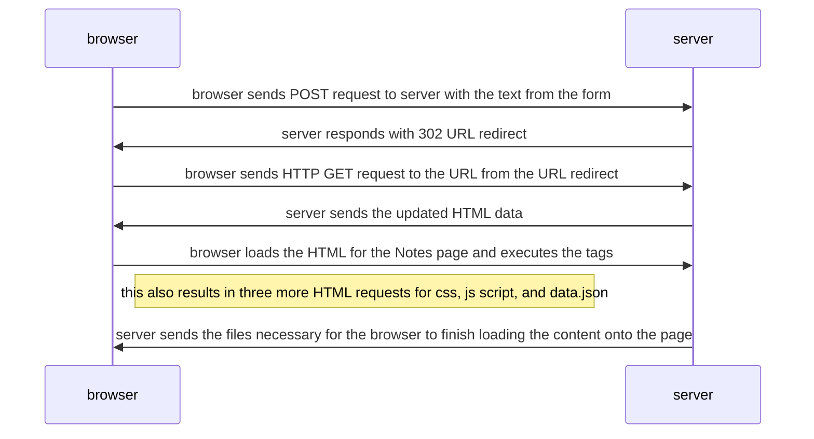

```mermaid
sequenceDiagram
  participant browser
  participant server

  browser->>server: browser sends POST request to server with the text from the form
  server->>browser: server responds with 302 URL redirect
  browser->>server: browser sends HTTP GET request to the URL from the URL redirect
  server->>browser: server sends the updated HTML data
  browser->>server: browser loads the HTML for the Notes page and executes the tags
  Note right of browser: this also results in three more HTML requests for css, js script, and data.json
  server->>browser: server sends the files necessary for the browser to finish loading the content onto the page
```
