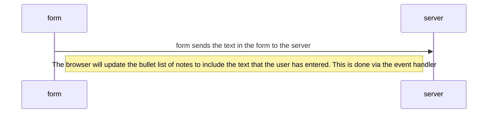

```mermaid
sequenceDiagram
  participant form
  participant server

  
  form->>server: form sends the text in the form to the server
  Note right of form: The browser will update the bullet list of notes to include the text that the user has entered. This is done via the event handler
```
