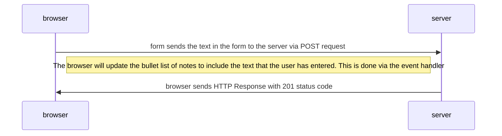

```mermaid
sequenceDiagram
  participant browser
  participant server

  
  browser->>server: form sends the text in the form to the server via POST request

Note right of browser: The browser will update the bullet list of notes to include the text that the user has entered. This is done via the event handler

  server->>browser: browser sends HTTP Response with 201 status code
```
